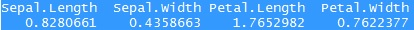
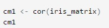
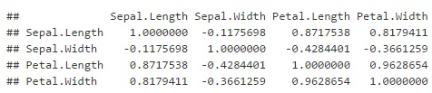

## PCA Transformation I

. Let's check the data

. Due to the non-negative feature, transform the numeric variables by logarithm first

. Print and plot can be directly applied on the PCA object produced by prcomp function

. Loadings and variance explained on each PC factors are printed and graphed

--- .class #id 
## PCA Transformation II

This function computes the standard deviation of the values in x. If na.rm is TRUE then missing values are removed before computation proceeds.

--- .class #id 
## Scatter plot

Show the relationship between two numeric variables

--- .class #id 
## Correlation matrix

Calculate and visualize the correlation between features

--- .class #id 
## Shiny App: IRISApp

[Random Forest with First Two Principal Components App Hosted by shinyapps.io](https://gviglioni.shinyapps.io/IrisApp/)

--- .class #id 
## Thank you!

Feel free to send me your comments,questions or report bugs [gviglioni@gmail.com].
